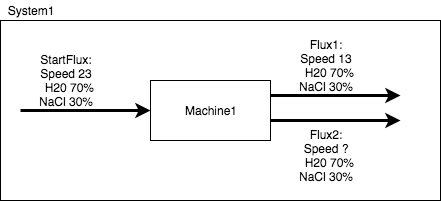

# ChemSim
ChemSim is a simple and easy to use tool that allows engineers to calculate mass balances, thus freeing  them to work on the more complicated problems. Future professionals without programming experience can also use it as an educational tool.

## Motivation
As engineering students, we are aware of the problems that our fellow engineers face on their day to day. One of these problems is finding the mass balance in a system. An easy to use tool that can solve mass balance problems is a huge advancement for all of the professionals and students that rely on these calculations every day to do their work. ChemSim is aimed at Chemical Engineers and other professionals with no previous programming experience, or with limited time.

## Language Features
Simulate a system by defining its fluxes and machines. Unknowns will be calculated by ChemSim!
### Commands:
```
create flux <name> <speed> <compund_and_percentage_list>
create machine <name> input <flux_list> output <flux_list>
create system <name> <machine_list>
run
save
```
### Example:

```
create flux StartFlux 23 H2O 70 NaCl 30
create flux Flux1 13 H2O 70 NaCl 30
create flux Flux2 ? H2O 70 NaCl 30
create machine Machine1	input StartFlux	output Flux1 Flux2
create system System1 Machine1
run System1
save System1
```

### To run:
1. Download Python 3
2. Download ChemSim
3. Write your .csim file with the above commands
4. Run: python3 ChemSim.py MyProgram.csim

or

1. Download Python 3
2. Download ChemSim
3. Run: python3 ChemSim.py
4. Use the CLI to write your program line by line

### Output:
After defining your system, the "run" command will solve the system and the "save" command will produce a
.csv file that you can open in Excel.

## Approach
ChemSim was made using the PLY library. The ChemSimLex.py file defines the language. ChemSimYacc.py defines grammar and calls 
the required tools. ChemSimTools.py has all the required tools to solve the defined system. ChemSim.py runs the main program.
